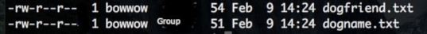
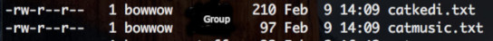

**FTP Mystery**
**Alexandra Andrews**

Scientific, artistic, religious and academic discoveries are hiding in plain site. With an investigation of forgotten basement collections in museums, universities, old houses, walls, tombs, etc., lost knowledge comes into the light.

The same seems to be true in Computer Code. Can it be that in the search for the new exciting latest whatever, we have become blinded to old basics.

I rediscovered a security hole in the basic UNIX file system. There is no need to steal Tappy’s arm as in the Huawei case. Users can blithely waltz into and adopt files. I was using this pathway in the early 2000s. Thought it had been plugged, but alas – **No**!

I invented this website code in 2000\. After reading about using viewport in CSS, I asked **why?** I put up my code for [Always Responsive Accessible Web Page Display and Printing For Any Device](https://github.com/arinitti/Always-Responsive-pages) on GitHub in June 2018\. The idea took over the net.

Now I have discovered a FTP permissions issue. FTP (File Transfer Protocol) or SFTP(Secure File Transfer Protocol) are both impacted by this mystery. FTP can be used to change ownership of files. In researching the net, I have not found any documentation or mention regarding this possible security hole. FTP is used by thousands daily. Is this problem overlooked? Did the documentation disappear in rewrites? Who knows?

<dl>

<dt>For my satisfaction, I am publishing examples of this mystery.
- I am using a terminal shell on a local MAC.
- I am writing the files with vim.
- For the examples - I have created two user accounts.</dt>
<dd>
- BowWow
- Meow
</dd>

<dt>I have used both ftp and sftp to access several servers with different distributions.

**FTP Example**:
</dt>

<dd>- Using ftp _put_ to place the file dogfriend.txt on the ftp server.
The permissions are 644, but the ownership changes to the name of the ftp account. The file data is not changed.
Using ftp _get_ to download the file into the local account, the permissions remain 644 but ownership changes to match the account name.
FTP seems unable to discriminate between correct and incorrect users.

</dd>

<dt>**SFTP Example**:</dt>

<dd>- Again discrimination between correct and incorrect accounts is missing.
- Permissions remain 644.
- File data is not affected.

- File ownership reflects the account whether on the sftp server or local sftp.</dd>

</dl>

**File Examples:**
[Cat Kedi](catkedi.txt)
[Cat Music](catmusic.txt)
[Name Caller](dogname.txt)
[Dog Friend](dogfriend.txt)

<dl>

<dt>**FTP**

Uploading files from local host to (s)ftp server.</dt>

<dd>

</dd>

<dt>- FTP user now owns the files.</dt>

<dd>
/dd>

<dt>**SFTP**

- SFTP user now owns the files.</dt>

<dd>

</dd>

<dt>**New Ownership Transfered by (S)FTP**

- User meow files now owned by bowwow</dt>

<dd>

</dd>

<dt>- User bowwow files now owned by meow
</dt>

<dd>

</dd>
</dl>

What do you think? Thank you for reading.

